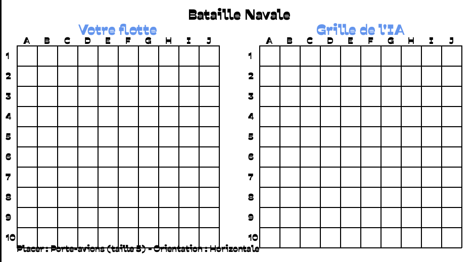
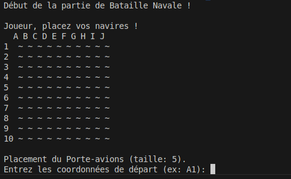

# Bataille Navale Python ⚓

Bienvenue sur MON projet Bataille Navale ! Oui, c'est bien moi qui l'ai codé, et c'est surtout pour tester mes skills Python (et prouver que je peux faire autre chose que des scripts pour trier des fichiers !).

## 🚀 Présentation rapide

- **Mode console** : le jeu fonctionne parfaitement dans le terminal. C'est rapide, efficace, et ça sent bon le rétro !
- **Mode graphique (Pygame)** : parce que j'aime les pixels et les interfaces modernes, j'ai aussi pondu une version Pygame avec fond stylé, police custom, et tout le tralala.
- **IA intelligente** : l'ordi ne tire pas au hasard, il réfléchit (parfois plus que moi le lundi matin).

## 🖼️ À quoi ça ressemble ?

> Ici tu peux ajouter des captures d'écran de l'interface Pygame ou du terminal !




*(Remplace ces images par tes propres screenshots !)*

## 🤓 Installation

1. Clone ce dépôt (parce que tu le vaux bien) :
   ```bash
   git clone <url-du-depot>
   cd bataille_navale
   ```
2. Installe les dépendances :
   ```bash
   pip install -r requirements.txt
   ```
3. (Optionnel) Installe Pygame si tu veux la version graphique :
   ```bash
   pip install pygame
   ```

## 🎮 Comment jouer ?

### En mode console (old school)
```bash
python main.py
```

### En mode Pygame (pour les yeux)
```bash
python main_pygame.py
```

- Place tes navires à la souris, change l'orientation avec la barre espace.
- Clique sur la grille de l'IA pour tirer.
- Le premier à couler tous les navires adverses gagne (logique, non ?)

## 🗂️ Structure du projet

- `main.py` : le jeu en mode console (pur, simple, efficace)
- `main_pygame.py` : la version graphique (plus sexy)
- `src/` : toute la logique du jeu (IA, plateau, joueurs...)
- `assets/fonts/Police.ttf` : la police qui claque
- `assets/images/` : mets ici tes screenshots !

## 👨‍💻 Pourquoi ce projet ?

Juste pour tester mes compétences Python, m'amuser, et montrer que je peux coder un vrai jeu (et pas juste des scripts pour renommer des fichiers, hein !). Si tu veux t'en inspirer, vas-y, c'est open !

## 📜 Licence

Ce projet est open-source, sous licence MIT. Fais-en bon usage, mais évite de le vendre à Ubisoft (ou alors, pense à moi !).

---

*Projet codé avec amour, café, et un peu de mauvaise foi quand l'IA gagne trop souvent.*